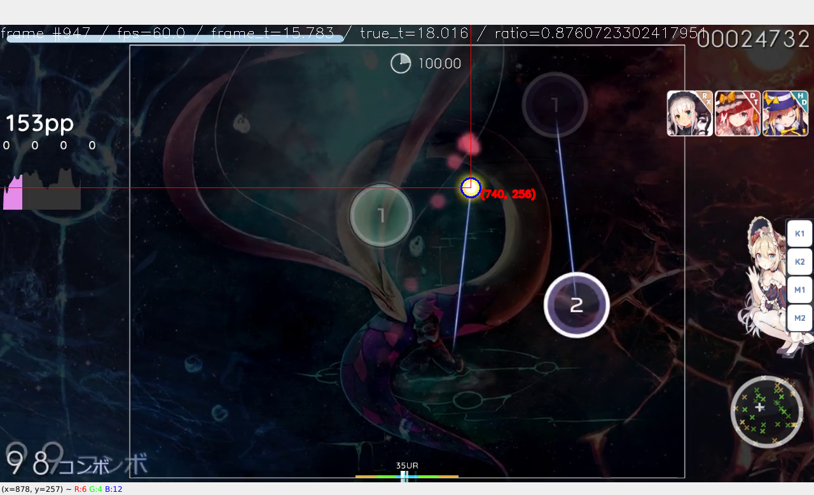

Archive of a personal project.

Read in a https://ordr.issou.best rendered osu replay and detect the cursor position in frame with OpenCV. Can be used for rebuilding a missing `.osr` from its recording.

# Demo
Read `example_replay_renders/magma_fc.mp4` and show an OpenCV window rendering the video and the detected cursor position with extra info in real-time.
```console
$ poetry run python3 run.py --cursor-radius 14 example_replay_renders/magma_fc.mp4
```


